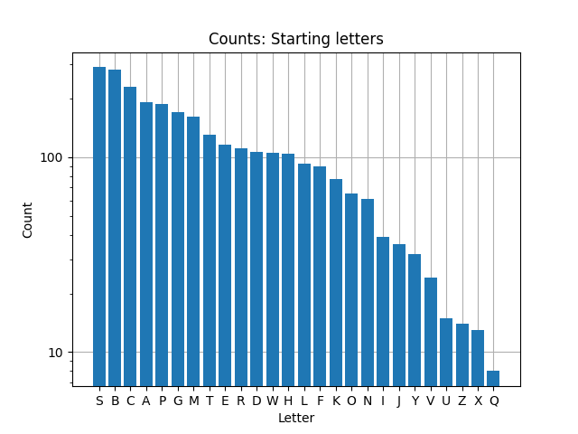
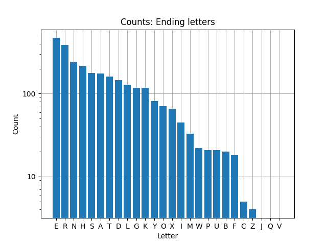

# woordslang

To research:
- Network flow model in minizinc?
- Graph longest path search

## Data sources
- https://a-z-animals.com/animals/

## Models

### Edge count based graph
- Node for each letter
- Directional links between nodes for all start and end letter combinations
- Capacity on edge based on animal group counts
- In minizinc:
    - Decision variable per edge
    - 1 node allowed with 1 more outgoing than incoming (and vice versa)
    - maximize sum of all group counts

### Node vcount based graph
- Node for each start and end letter combination
- 'Remove' node when visited as much as possible
- Directional link between all 

